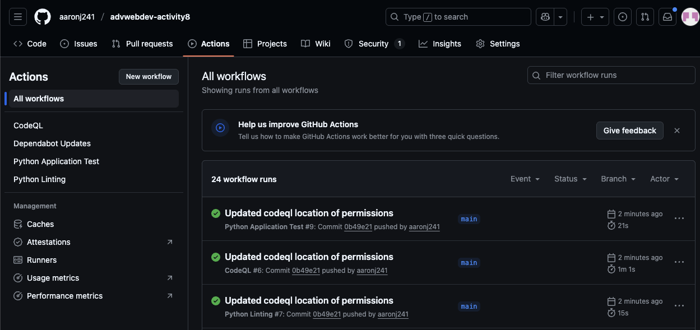
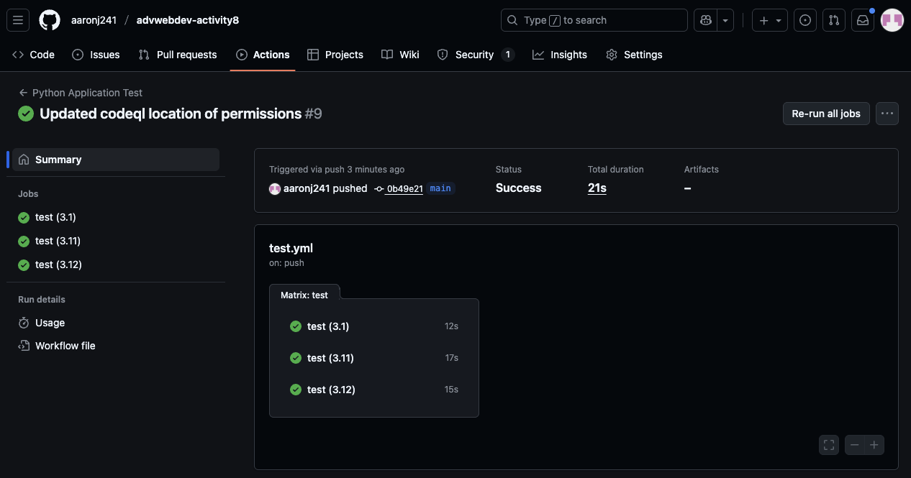
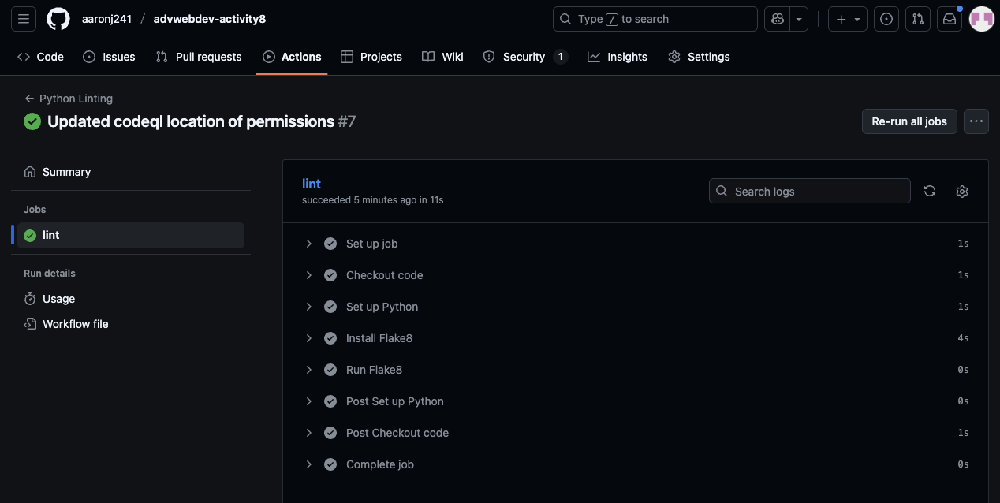
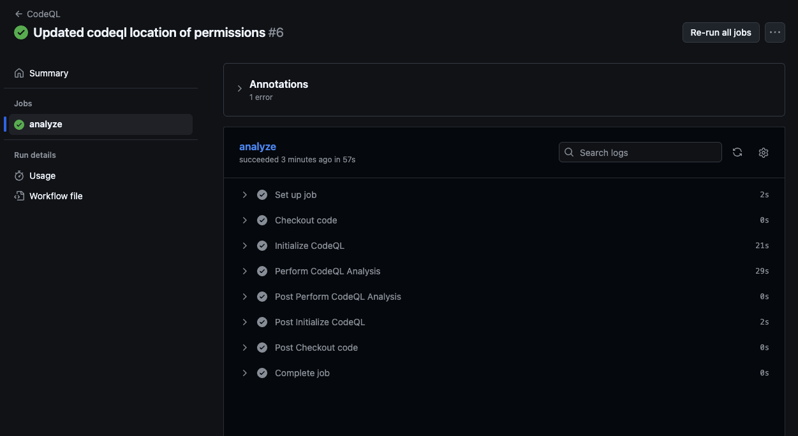
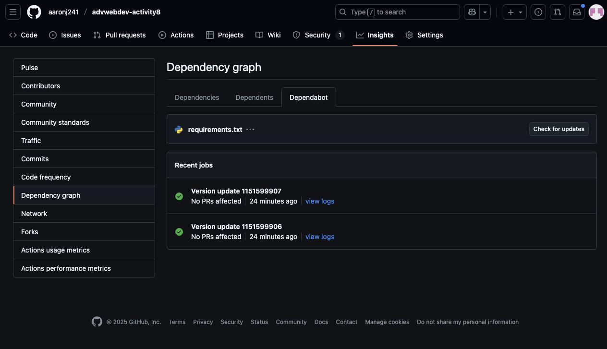

# advwebdev-activity8
Activity 8 for Advanced Web Development

---

Name: Aaron James, Student Number: 100830371, Date: Nov 13th, 2025, Assignment: Acitivity 8

---

## Implemented Endpoints

**Location:** `app.py`

### 1. `GET /hello`

```python
@app.route('/hello', methods=['GET'])
def hello():
    return jsonify(message="Hello, World!")
```

**Request:**

- Method: `GET`
- Path: `/hello`
- Body: _None_

**Response:**

- Status code: `200 OK`
- Body (JSON):

```json
{
  "message": "Hello, World!"
}
```

---

### 2. `POST /echo`

```python
@app.route('/echo', methods=['POST'])
def echo():
    data = request.get_json(force=True)
    return jsonify(data), 201
```

**Request:**

- Method: `POST`
- Path: `/echo`
- Body: JSON object of any shape, for example:

```json
{
  "msg": "ping"
}
```

**Response:**

- Status code: `201 Created`
- Body (JSON):
```json
{
  "msg": "ping"
}
```

---

### 3. `PUT /update`

```python
@app.route('/update', methods=['PUT'])
def update():
    data = request.get_json(force=True)
    updated = {"updated": data}
    return jsonify(updated), 200
```

**Request:**

- Method: `PUT`
- Path: `/update`
- Body:

```json
{
  "value": 123
}
```

**Response:**

- Status code: `200 OK`
- Body (JSON):

```json
{
  "updated": {
    "value": 123
  }
}
```

---

### 4. `DELETE /delete/<item_id>`

```python
@app.route('/delete/<item_id>', methods=['DELETE'])
def delete(item_id):
    return jsonify({"deleted": item_id}), 200
```

**Request:**

- Method: `DELETE`
- Path: `/delete/<item_id>`
- Body: _None_

**Response:**

- Status code: `200 OK`
- Body (JSON):

```json
{
  "deleted": "84"
}
```

---

## Automated Tests

**Location:** `test_app.py`

### 1. `test_hello`
```python
import app


def test_hello():
    client = app.app.test_client()
    response = client.get('/hello')
    assert response.status_code == 200
    assert response.get_json() == {"message": "Hello, World!"}
```

**What it verifies:**

1. The `/hello` endpoint is reachable with a `GET` request.
2. Status code is `200`.
3. The JSON body is:

```json
{
  "message": "Hello, World!"
}
```

### 2. `test_echo`

```python
import app


def test_echo():
    client = app.app.test_client()
    payload = {"msg": "ping"}
    response = client.post('/echo', json=payload)
    assert response.status_code == 201
    assert response.get_json() == payload
```

**What it verifies:**

1. The `/echo` endpoint accepts a `POST` request with JSON.
2. It returns status code `201`.
3. The response body echoes the input JSON exactly.


---

### 3. `test_update`

```python
import app


def test_update():
    client = app.app.test_client()
    payload = {"value": 123}
    response = client.put('/update', json=payload)
    assert response.status_code == 200
    assert response.get_json() == {"updated": payload}
```

**What it verifies:**

1. The `/update` endpoint handles a `PUT` request.
2. It returns status code `200`.
3. The response wraps the input JSON in an `"updated"` object.

---

### 4. `test_delete`

```python
import app


def test_delete():
    client = app.app.test_client()
    response = client.delete('/delete/42')
    assert response.status_code == 200
    assert response.get_json() == {"deleted": "42"}
```

**What it verifies:**

1. The `/delete/<item_id>` endpoint accepts a `DELETE` request.
2. It returns status code `200`.
3. The response JSON includes the deleted item ID.

---

## Issues

1. Originally when trying to add the workflows to github, I encounter an error stating that it was unable to add the folder and files. I had to enable workflows in my github developer settings.

2. With the codeql-analysis.yml, I had to change the version for both the init and analyze to v3 from v1.

3. I had to add read and write permissions for the codeql test to pass

```
permissions:
      security-events: write
      actions: read
      contents: read
```

4. I had to remove the from flask import json in the test_app.py becuase it was an unused import that was being flagged by flake8 through the lint.yml.

---

## Success Screenshots











